## time and space complexity

- we are going to witness the time and space complexity.

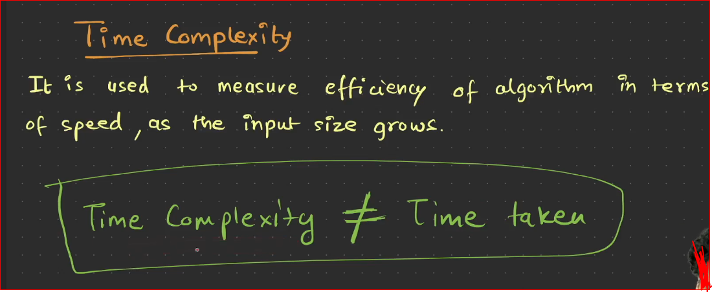

- Example of complexity

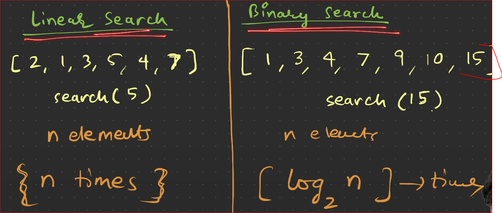

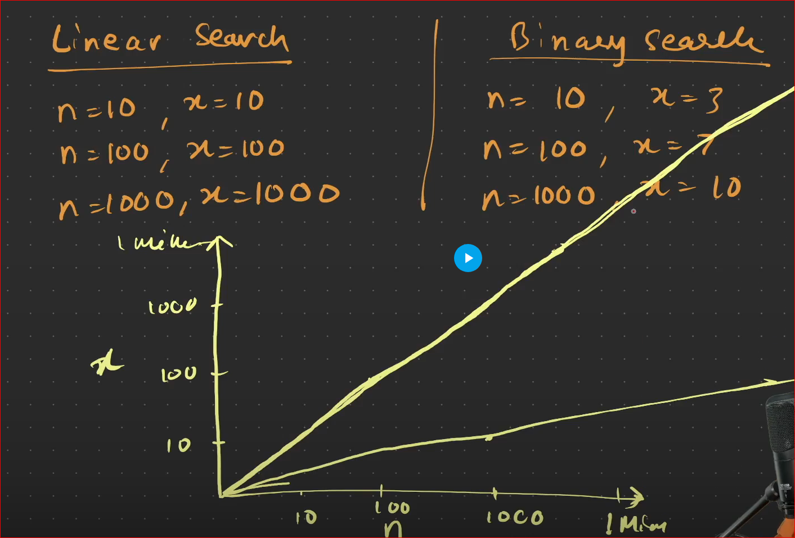

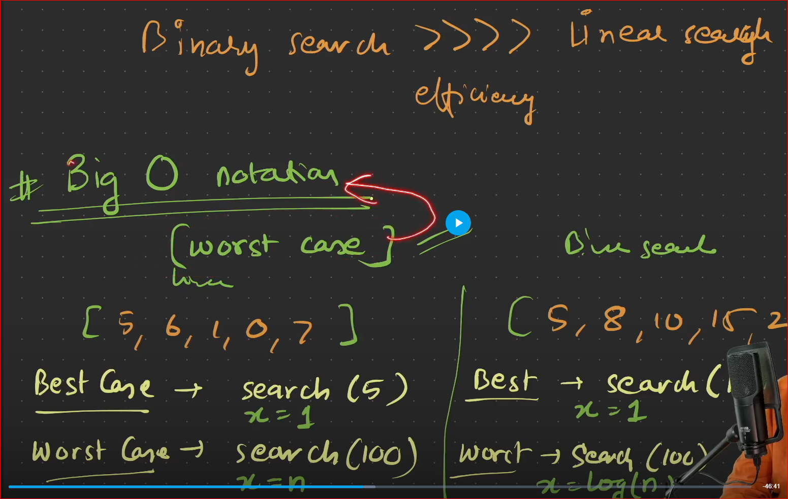

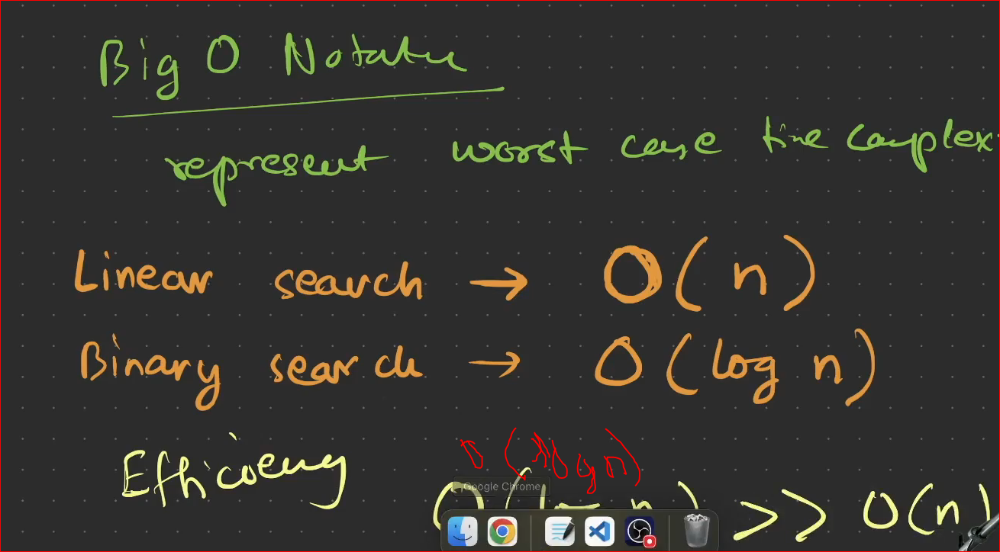

-----------

- list of time complexity in different scenarios

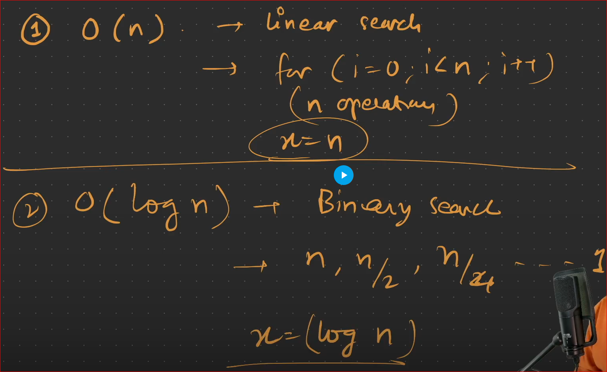

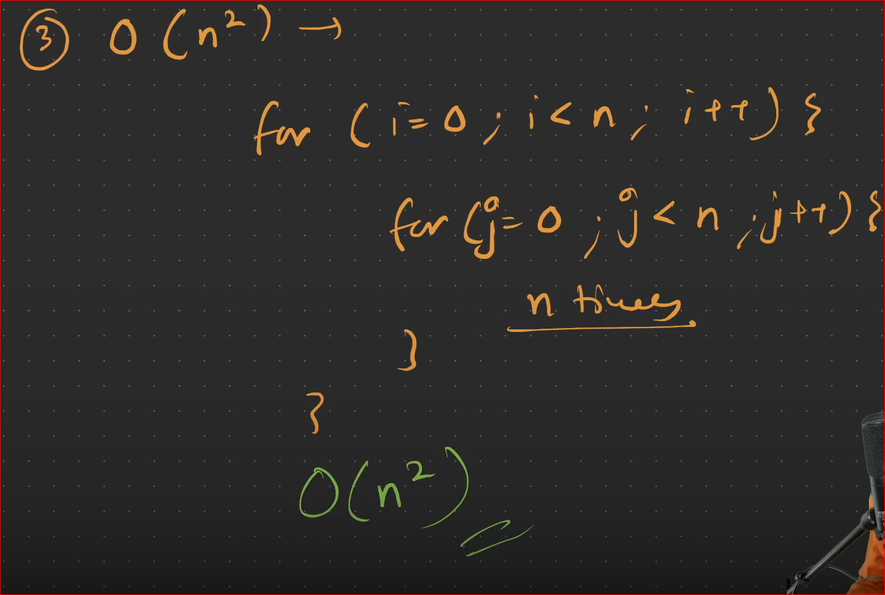

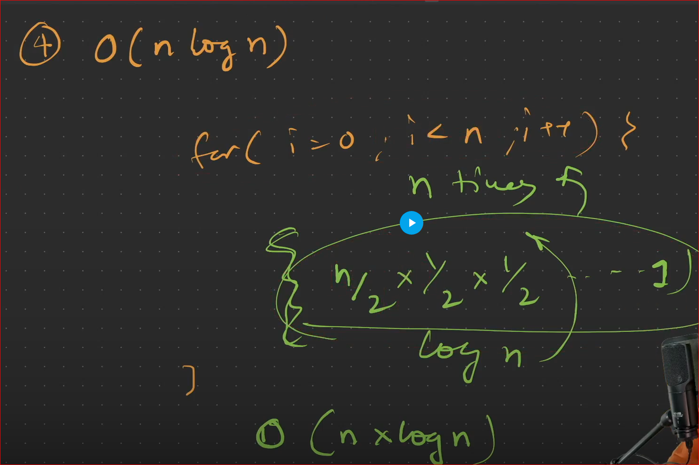

- the above image shows nlogn times because, if a loop runs n times inside that loop , again any binary search operation or log n operation then it is nlogn operation.

ex: example for above one is **merge sort**

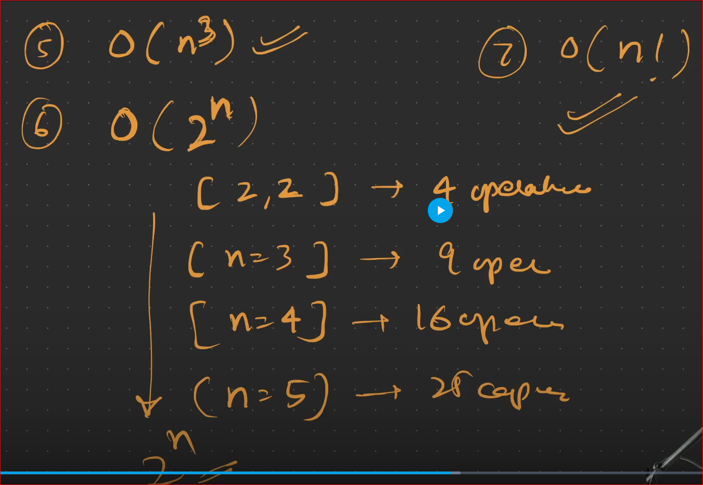

- Most popular time complexities frequently using

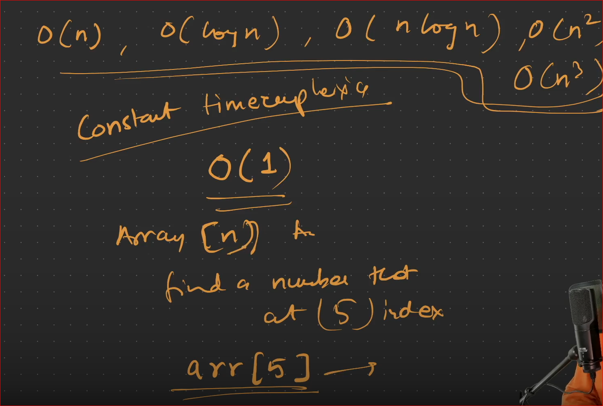

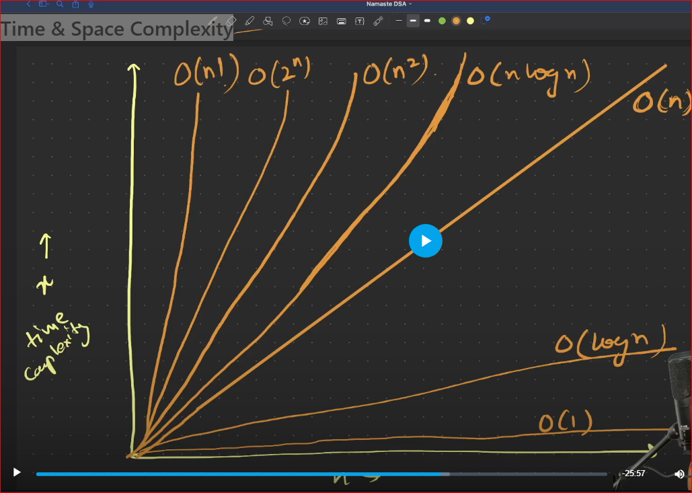

- alternative image of above one

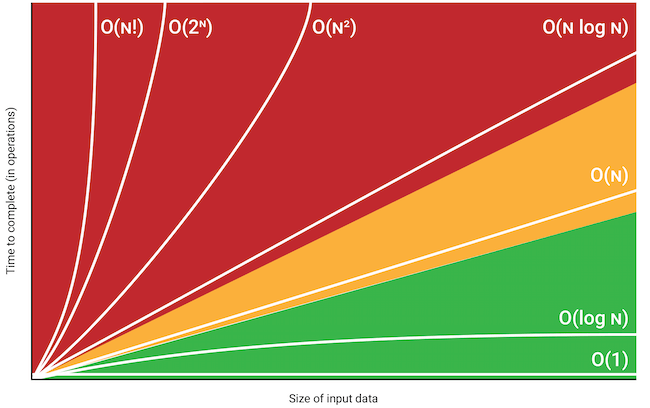

- Efficiency

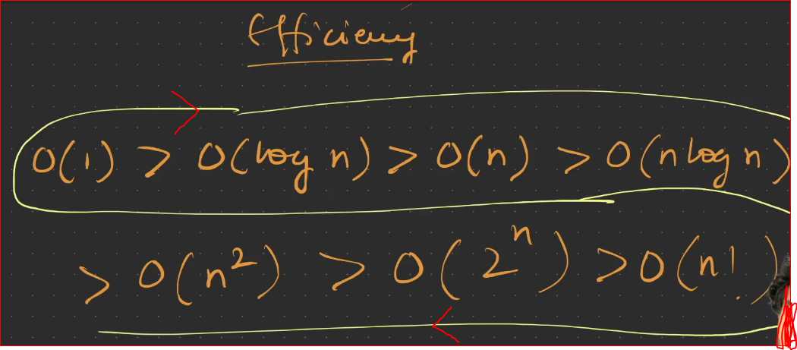